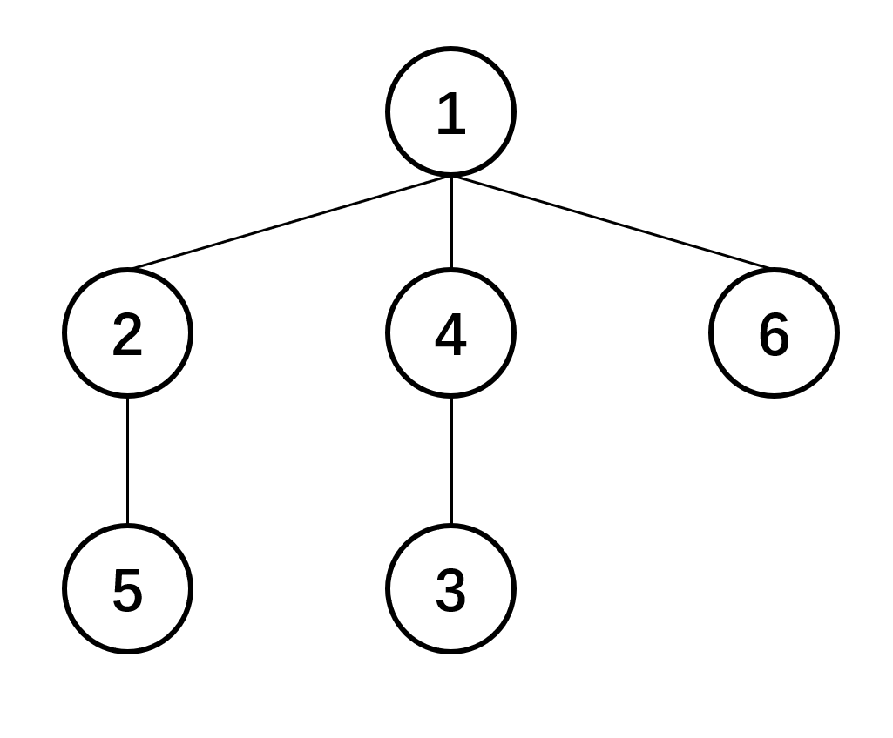

### 一、概念

Prufer数列是无根树的一种数列，其与无根树有着一一对应的关系。节点数为$n$的无根树所对应的Prufer数列长度为$n-2$。Prufer数列常用来解决树上计数问题。

### 二、算法原理

由于Prufer数列与无根树是一一对应的，我们可以考虑两者的互相转换。



以上图无根树为例

1. 无根树转化为Prufer数列

    - 找到度数为$1$，编号最小的节点
    - 将该节点的父节点加入数列，并从树上删除该节点
    - 重复以上操作直至树中仅剩两个节点

    图例示范：

    step1：找到度数为$1$编号最小的节点—节点$3$，将其父节点加入数列$\{4\}$，从树中删除该节点

    step2：找到度数为$1$编号最小的节点—节点$4$，将其父节点加入数列$\{4,1\}$，从树中删除该节点

    step3：找到度数为$1$编号最小的节点—节点$5$，将其父节点加入数列$\{4,1,2\}$，从树中删除该节点

    step4：找到度数为$1$编号最小的节点—节点$2$，将其父节点加入数列$\{4,1,2,1\}$，从树中删除该节点

    此时树上仅剩下两个节点，结束。该无根树对应的Prufer数列为$\{4,1,2,1\}$

2. Prufer数列转化为无根树

    - 取出数列第一个数
    - 取出点集(初始是$1-n$)中，不在数列(还没取出第一个数的数列)中的最小元素
    - 连接这两个数的边
    - 重复以上操作直到点集剩两个数，最后把点集剩下的两个数连边即可

    图例示范：

    Prufer数列为$\{4,1,2,1\}$，点集$\{1,2,3,4,5,6\}$

    step1：取出数列第一个数$4$，取出点集中不在数列中的最小元素$3$，连接$3—4$

    Prufer数列为$\{1,2,1\}$，点集$\{1,2,4,5,6\}$

    step2：取出数列第一个数$1$，取出点集中不在数列中的最小元素$4$，连接$1—4$

    Prufer数列为$\{2,1\}$，点集$\{1,2,5,6\}$

    step3：取出数列第一个数$2$，取出点集中不在数列中的最小元素$4$，连接$2—5$

    Prufer数列为$\{1\}$，点集$\{1,2,6\}$

    step4：取出数列第一个数$1$，取出点集中不在数列中的最小元素$2$，连接$1—2$

    Prufer数列为$\{\}$，点集$\{1,6\}$

    step5：连接$1—6$，结束。

**Prufer数列的性质：**

1. Prufer数列与无根树一一对应
2. 度数为$d_i$的节点在Prufer数列中会出现$d_i-1$次
3. 一个$n$个节点的完全图的生成树个数为$n^{n-2}$
4. 对于给定度数$d_i\space (i\in [1,n])$的一颗无根树共有$\frac{(n-2)!}{\prod_{i=1}^{n}(d_i-1)!}$种情况

### 三、代码

[P2290 数的计数](https://www.luogu.com.cn/problem/P2290)

```c++
#include <bits/stdc++.h>
#define INF 99999999
#define LINF LLONG_MAX
using namespace std;
typedef long long ll;
typedef unsigned long long ull;
const int MAX_N=200;

int c[MAX_N][MAX_N];
int ans,d[MAX_N];
int s,n;

int main(){
    freopen("1.in","r",stdin);
    ios_base::sync_with_stdio(false);
    cout.tie(0);
    cin.tie(0);
    //freopen("1.out","w",stdout);
    cin>>n;
    if(n==1){
        cin>>d[1];
        if(!d[1])
            cout<<1<<'\n';
        else
            cout<<0<<'\n';
        return 0;
    }
    for(int i=0;i<=n;i++){
        c[i][0]=1;
        for(int j=1;j<=i;j++)
            c[i][j]=c[i-1][j]+c[i-1][j-1];
    }
    for(int i=1;i<=n;i++){
        cin>>d[i];
        if(!d[i]){
            cout<<0<<'\n';
            return 0;
        }
        d[i]--;
        s+=d[i];
    }
    if(s!=n-2){
        cout<<0<<'\n';
        return 0;
    }
    s=0;
    ans=1;
    for(int i=1;i<=n;i++){
        ans*=c[n-2-s][d[i]];
        s+=d[i];
    }
    cout<<ans<<'\n';
    return 0;
}

/*
样例 
4                     
2 1 2 1
输出
2
*/
```

